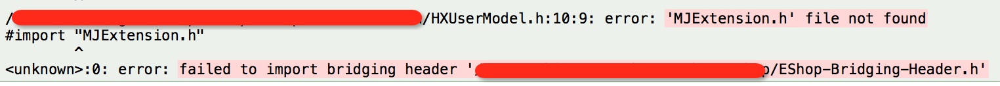
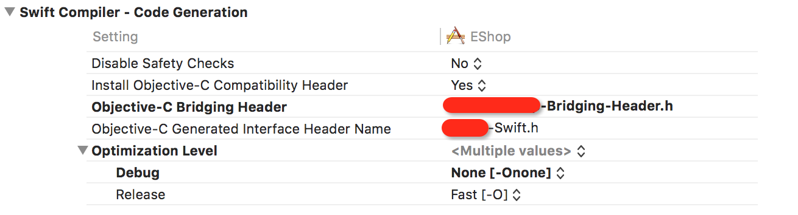

# 'Failed to import bridging header'奇葩解决方案

本人是个升级控，只要有需要升级的看看日志没啥问题就开整，等了大半年的`Cocoapods`的`1.0.0`终于出正式版本了，介于`0.38.0`到`0.39.0`的痛苦过程，心里有点小担心，不过那时还好是`Objective-C`，问题出在配置上都可以[`stackoverflow`](http://stackoverflow.com/)解决，这次要面对这次还要多面临`Swift`的挑战，废话太多了，直接开整。

升级的过程还是老套路：

```bash
sudo gem install cocoapods
```

老套路还是还是老问题`/usr`下路径权限不够，试着改变权限：

```bash
sudo chown $(whoami):admin /usr/local && sudo chown -R $(whoami):admin /usr/local
```

```bash
sudo chown $(whoami):admin /usr/bin && sudo chown -R $(whoami):admin /usr/bin
```

改变`/usr/local`的权限没有问题，新提示的`/usr/bin`通过这种方式没办法改权限，由于`OS X EI Capitan`安全措施`Rootless机制`，导致`/usr/bin`不能随意写文件操作，但是想改还是有办法的，网上去年就贴出了这个解决方法，就是在安全模式下操作终端命令，这里不想误导非程序狗去操作这个大风险的玩意儿，所以这里我简单给出[`苹果官方解决方案`](https://developer.apple.com/videos/play/wwdc2015/706/)，看看就好，我就不详细介绍了，有需要的搜索关键字`Operation not permitted`。

由于我洁癖比较严重，既然官方不让搞咱们就另辟蹊径，对于`gem`来说，其实是可以在`install`的时候使用`-n`参数来指定路径的，那么这里我们就选择`/usr/local/bin`这个可写的路径来操作，废话不多说，直接上命令：

```bash
sudo gem install -n /usr/local/bin cocoapods
```

这个命令也是大多数人多于安装`Cocoapods`的`1.0.0`版本报权限问题给出的解决方案，但是这里有个小问题，由于以前的老版本是默认安装在`/usr/bin`，我们这要操作之后就有两个`pod`，实际使用的时候系统就傻傻分不清了，很多人觉得改下系统的`bash`再`source`不久好了，其实我最讨厌这种做法，我的原则不到万不得已不做额外的操作，经过我一晚上的跳坑，得到的解决方案就是先删除老版本的`Cocoapods`，然后直接用上面的命令安装即可。

新版是安装好了，那必须得`pod update`一下啊，不然咋体验升级的快感，你说是不，结果可想而知的肯定是报错，提示需要指明`target`才能执行`pod`，对于新版本的严谨我很欣赏，于是乎就得改改我们老的`Podfile`：

```ruby
platform :ios, '8.0'
use_frameworks!

target 'EShop' do
	pod 'xxx'

end
```

`use_frameworks`加不加看你自己需求，如果是版本都用到`8.0`了还不用动态库就是脑壳有屎，不知道动态库和静态库的自己查资料。或者说还有人在`8.0`下坚持写`Swift`的我也很是佩服。

`Bingo`，果不其然，这盘顺利`update`了之后`Build`新工程，得到如下的煞笔提示：



踏马的提示`桥接文件`找不到，于是乎上`stackoverflow`各种找答案啊，最后得来的都是让确保如下配置是否正确：



我踏马升级之前都是好的，工程配置和文件肯定是好的啊，看到各种复制粘贴的答案那叫一个暴躁，作为程序狗这个时候必须点根烟冷静一盘，突然定睛一看其实不是找不到`桥接文件`，而是`failed to import bridging header`导入出错，仔细分析了一下踏马的原来是找不到头文件儿导致`桥接文件`导入出错。由于`Cocoapods`新版本的问题是根据`target`来`install`的，所以在头文件导入上较以前严谨太多了，所以上述的解决方案就是用`库的方式引入`，不要用`相对导入`，学过`C`的应该在第一课的时候就知道这个事情了，所以上述问题就这么改：

```swift
#import "MJExtension.h"
```

改为

```swift
#import <MJExtension/MJExtension.h>
```

其实这种问题在纯`Objective-C`项目里即便是新版本也没有问题的，主要是`1.0.0`以后的`Cocoapods`强制的`target`的概念，又由于`Objective-C`和`Swift`混编的项目需要`xxx-Bridging-Header.h`这个`桥接文件`，所以`import`的时候必须要用`库`的引入方式才能正常导入。

其实平时只要是用到库，不管是静态还是动态我都是用`<>`库的方式来导入，为啥这里会煞笔呢，那就安利一款快速添加头文件的插件，对于写纯`Objective-C`的同学来说是很提高效率的插件：[`Peckham`](https://github.com/markohlebar/Peckham)

PS：不过`Xcode 7.3`以后因为`Xcode`自身的原因，猜测可能是项目解析慢或者是预处理不及时，导致像`FuzzyAutocomplete`这类插件都有点力不从心了，`7.3`以后的版本使用`Peckham`也开始蛋疼起来，如果是新添加的`.h`和`.m`文件找不到，直接`Command + B`build一盘就好了。